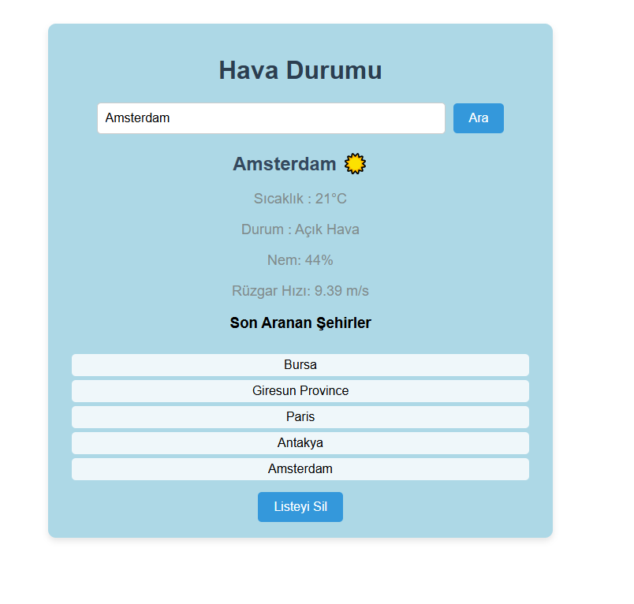

# Hava Durumu Uygulaması 🌤️

React ile geliştirilmiş gerçek zamanlı hava durumu takip uygulaması

## Özellikler ✨

- 🏙️ Şehir ismiyle anlık hava durumu sorgulama
- 🌡️ Sıcaklık, nem ve rüzgar hızı bilgileri
- 🌈 Hava durumuna göre değişen arka plan renkleri
- 📍 Son aranan 5 şehri listeleme
- 🗑️ Arama geçmişini temizleme
- ⚡ Hava durumu ikonları ve Türkçe çeviriler
- 🛑 Hatalı girişlerde uyarı sistemi
- ⏳ Yüklenme durumu göstergesi

Kullanım 📖
Şehir adını girin ve "Ara" butonuna tıklayın

Anlık hava durumu bilgilerini görüntüleyin

Son aramalardan bir şehre tıklayarak tekrar sorgulayın

Arama geçmişini silmek için "Listeyi Sil" butonunu kullanın

Kullanılan Teknolojiler 💻

React

TypeScript

Axios

OpenWeather Map API

<!--  -->

## Güncellemeler

### [25.03.2025]

- Harita özelliği eklendi (OpenLayers kullanıldı).
- Son aranan şehirler haritada gösterilebiliyor.
- Kullanıcı artık şehirleri harita üzerinde görebilir.
